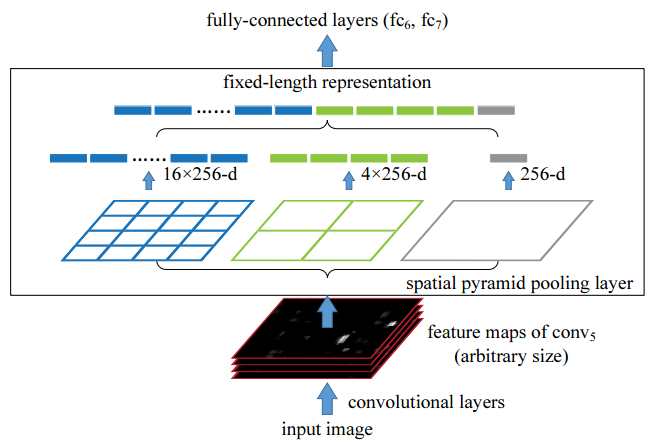
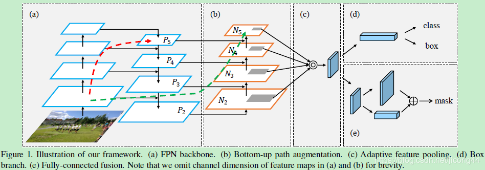
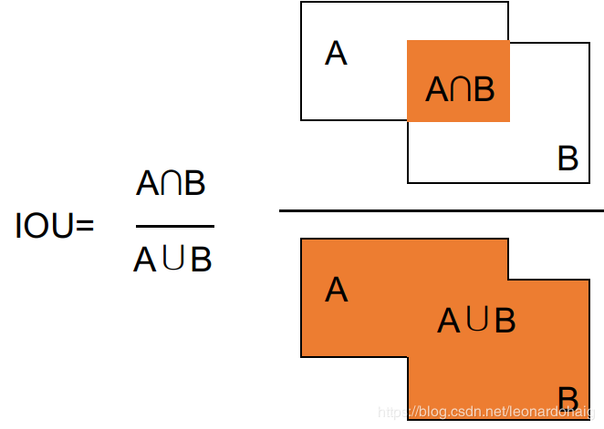
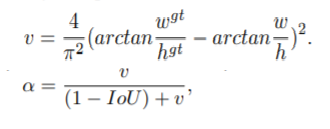

---

# One Stage Object Detection

作者:孟令龙                                                                                                                                             

实习导师：李科健

------

## One-stage算法分析

## 原理分析

------

这是一篇关于目标检测调优问题的markdown，你可以会问为什么yoloV4出来了还需要v3？

**我个人觉得YOLOV3是非常经典的单阶段目标检测论文，有了对于V3的深入了解我们能够非常好的过度到V4版本，所以V3是值得我们深入的探讨baseline**

### 检测结构包含

- **backbone**残差结构的darknet53
- FPN的三种模式的设计
- Loss设计
- NMS/K-Means/IOU
- 

------

#### 骨干网络 **backbone**

1.残差网络到底有什么好处，他在解决一个什么问题，为什么会显著性提升yolo的性能？？我们还可以如何改进？？

------

##### 模型退化与梯度消失：

链接：https://zhuanlan.zhihu.com/p/31852747

深度网络的退化问题至少说明深度网络不容易训练。但是我们考虑这样一个事实：现在你有一个浅层网络，你想通过向上堆积新层来建立深层网络，一个极端情况是这些增加的层什么也不学习，仅仅复制浅层网络的特征，即这样新层是恒等映射（Identity mapping）。在这种情况下，深层网络应该至少和浅层网络性能一样，也不应该出现退化现象。好吧，你不得不承认肯定是目前的训练方法有问题，才使得深层网络很难去找到一个好的参数。

这个有趣的假设让Kaiming灵感爆发，他提出了残差学习来解决退化问题。对于一个堆积层结构（几层堆积而成）当输入为 ![[公式]](https://www.zhihu.com/equation?tex=x) 时其学习到的特征记为 ![[公式]](https://www.zhihu.com/equation?tex=H%28x%29) ，现在我们希望其可以学习到残差 ![[公式]](https://www.zhihu.com/equation?tex=F%28x%29%3DH%28x%29-x) ，这样其实原始的学习特征是 ![[公式]](https://www.zhihu.com/equation?tex=F%28x%29%2Bx) 。之所以这样是因为残差学习相比原始特征直接学习更容易。当残差为0时，此时堆积层仅仅做了恒等映射，至少网络性能不会下降，实际上残差不会为0，这也会使得堆积层在输入特征基础上学习到新的特征，从而拥有更好的性能。残差学习的结构如图4所示。这有点类似与电路中的“短路”，所以是一种短路连接（shortcut connection）。

图4 残差学习单元

为什么残差学习相对更容易，从直观上看残差学习需要学习的内容少，因为残差一般会比较小，学习难度小点。不过我们可以从数学的角度来分析这个问题，首先残差单元可以表示为：

![[公式]](https://www.zhihu.com/equation?tex=%5Cbegin%7Balign%7D+%26+%7B%7By%7D_%7Bl%7D%7D%3Dh%28%7B%7Bx%7D_%7Bl%7D%7D%29%2BF%28%7B%7Bx%7D_%7Bl%7D%7D%2C%7B%7BW%7D_%7Bl%7D%7D%29+%5C%5C+%26+%7B%7Bx%7D_%7Bl%2B1%7D%7D%3Df%28%7B%7By%7D_%7Bl%7D%7D%29+%5C%5C+%5Cend%7Balign%7D+) 

其中 ![[公式]](https://www.zhihu.com/equation?tex=x_%7Bl%7D) 和 ![[公式]](https://www.zhihu.com/equation?tex=x_%7Bl%2B1%7D) 分别表示的是第 ![[公式]](https://www.zhihu.com/equation?tex=l) 个残差单元的输入和输出，注意每个残差单元一般包含多层结构。 ![[公式]](https://www.zhihu.com/equation?tex=F) 是残差函数，表示学习到的残差，而 ![[公式]](https://www.zhihu.com/equation?tex=h%28x_%7Bl%7D%29%3Dx_%7Bl%7D) 表示恒等映射， ![[公式]](https://www.zhihu.com/equation?tex=f) 是ReLU激活函数。基于上式，我们求得从浅层 ![[公式]](https://www.zhihu.com/equation?tex=l) 到深层 ![[公式]](https://www.zhihu.com/equation?tex=L) 的学习特征为：

![[公式]](https://www.zhihu.com/equation?tex=%7B%7Bx%7D_%7BL%7D%7D%3D%7B%7Bx%7D_%7Bl%7D%7D%2B%5Csum%5Climits_%7Bi%3Dl%7D%5E%7BL-1%7D%7BF%28%7B%7Bx%7D_%7Bi%7D%7D%7D%2C%7B%7BW%7D_%7Bi%7D%7D%29) 

利用链式规则，可以求得反向过程的梯度：

![[公式]](https://www.zhihu.com/equation?tex=%5Cfrac%7B%5Cpartial+loss%7D%7B%5Cpartial+%7B%7Bx%7D_%7Bl%7D%7D%7D%3D%5Cfrac%7B%5Cpartial+loss%7D%7B%5Cpartial+%7B%7Bx%7D_%7BL%7D%7D%7D%5Ccdot+%5Cfrac%7B%5Cpartial+%7B%7Bx%7D_%7BL%7D%7D%7D%7B%5Cpartial+%7B%7Bx%7D_%7Bl%7D%7D%7D%3D%5Cfrac%7B%5Cpartial+loss%7D%7B%5Cpartial+%7B%7Bx%7D_%7BL%7D%7D%7D%5Ccdot+%5Cleft%28+1%2B%5Cfrac%7B%5Cpartial+%7D%7B%5Cpartial+%7B%7Bx%7D_%7BL%7D%7D%7D%5Csum%5Climits_%7Bi%3Dl%7D%5E%7BL-1%7D%7BF%28%7B%7Bx%7D_%7Bi%7D%7D%2C%7B%7BW%7D_%7Bi%7D%7D%29%7D+%5Cright%29) 

式子的第一个因子 ![[公式]](https://www.zhihu.com/equation?tex=%5Cfrac%7B%5Cpartial+loss%7D%7B%5Cpartial+%7B%7Bx%7D_%7BL%7D%7D%7D) 表示的损失函数到达 ![[公式]](https://www.zhihu.com/equation?tex=L) 的梯度，小括号中的1表明短路机制可以无损地传播梯度，而另外一项残差梯度则需要经过带有weights的层，梯度不是直接传递过来的。残差梯度不会那么巧全为-1，而且就算其比较小，有1的存在也不会导致梯度消失。所以残差学习会更容易。要注意上面的推导并不是严格的证明。

[resnet](https://zhuanlan.zhihu.com/p/42706477)


### **Head**（大中小三种尺度预测解决了什么问题，结合常用的attention机制如何进行感受野模块的设计？）

------

在NIPS2016的有关于感受野的文章中我们可以知道是，3*3的卷积的感受野比较有限，但是如果我们在一个小的feature map中3×3的感受野就会变得比较大，在一个大的feature map中3×3的感受野就比较小，从这个角度来说，为了解决不同尺度目标检测的问题，YOLOV3就采用这样分离感知的设计。

**跳层结构**我们在Resnet、Unet++、DenseNet这一系列网络中了解到了，减少CNN在特征提取中的信息流失。这种方法特别类似于我们控制系统中的闭环控制，起到一种参数调整以及高层信息与底层信息互通的效果。

针对这样的情况YOLOV3就采取了这样的设计，我们回顾文章你就会知道v3版本的YOLO仅仅是一个baseline，如果我们要提升准确度，还可以根据这两点增加不同的模块设计。

[https://zhuanlan.zhihu.com/p/42706477]:

------

### 聚合感知和分离感知对于视觉任务的一种启示

​		FPN结构这种思路类似于在2015年的Unet，现今为止，Unet网络结构也是非常重要的baseline，在医疗图像和缺陷分割应用甚多。在语义分割中我们经常了解到聚合感受野模块对于语义分割网络的提升，如：ASPP、self Attention，后续的研究人员在感受野分析过程中也表明了这些聚合感知模块能够极大的提升网络的感受野，所以后续文章有很多针对于这方面的东西出现，如：Dense_deeplab、RBF、ASFF。对现有的聚合感知模块增加或者优化，提升网络的预测性能已经是一种必不可少的趋势。作为非常好的baseline的yolov3也是如此，只要在三个分离的head中加入空间空洞卷积就能让他有不少的提升。

YOLOV4中的聚合感知采用了两种设计结构一种是SPP，SPPnet是一篇非常早期的论文,利用不同stride的maxpooling操作来获得更大的感受野，不得不佩服这样不损失速度又增强性能的方法。

#### SPP



​		spp提出的初衷是为了解决CNN对输入图片尺寸的限制。由于全连接层的存在，与之相连的最后一个卷积层的输出特征需要固定尺寸，从而要求输入图片尺寸也要固定。spp-net之前的做法是将图片裁剪或变形（crop/warp）. 简而言之，即是将任意尺寸的feature map用三个尺度的金字塔层分别池化，将池化后的结果拼接得到固定长度的特征向量（图中的256为filter的个数），送入全连接层进行后续操作。后来的Fast RCNN网络即借鉴了spp的思想。其中的ROI Pooling可理解为单尺度的SPP层。


​		在yolo4中使用的是如上图的结构,池化的size分别为[1,5,,9,13],池化要保持特征图大小一致和通道数一致,再将池化后的特征进行concatenate.

另外一种结构就是PAnet，这样的结构采用类似双FPN的设计。

#### PAN



​        总体上是Mask-Rcnn的改进版本，整体思路是提高信息流在网络中的传递效率。第一个改进：为了提高低层信息的利用率，加快低层信息的传播效率，提出了Bottom-up Path Augmentation；第二个改进：通常FPN在多层进行选anchors时，根据anchors的大小，将其分配到对应的层上进行分层选取。这样做很高效，但同时也不能充分利用信息了，提出了Adaptive Feature Pooling。第三个改进：为了提高mask的生成质量，作者将卷积-上采样和全连接层进行融合，提出了Fully-connected Fusion。

#### ASPP：

另外一种结构就是ASPP，这个是我非常喜欢一种结构，最近常常用于目标检测中，他来源于deeplabV3+这篇论文。


#### Attention:

1.骨干网络里的SE模块


1. 通道注意力机制和空间注意力机制模块

   

3.多尺度注意力机制


​		多尺度注意力机制，很好诠释了分离感知和聚合感知的结合能够极大的提升网络的性能。

​		目前来说，语义分割中针对的数据集都是以自动驾驶的cityscapes为主，大部分的baseline也是基于这个数据集进行相关的设计，cityscapes数据集中很多语义分割网络通常会遇到感受野不够大的问题，如：一个巴士可能占据图片的百分之七十，巴士中有很多镜面的反射，这些反射可能是人可能是街景。如果我们的网络设计感受野不够大，就非常容易出现歧义的问题，这些歧义往往会影响精度。

​		当然，过分关注一个问题，就容易忽略其他的问题。

​		实际过程中我们遇到的视觉问题往往是千变万化的，如果我们感受野需求比较小，我们强行加入聚合感受野模块，对准确度提升不是很大，也会降低网络的速度。

​		结合YOLO分离设计，我们可以引入这样的思考：可以采用分离感知的方法处理图像分割中确定的大中小目标分割问题呢？我想这应该是一个非常好的idea。

​		当然感受野设计是非常重要，也是非常学术的问题，需要后续周密的实验数据来支撑这一个想法。

------

### LOSS设计：减小网络的回归任务

​		先验数据非常的重要，传统的图像特征提取设计，往往结合了视觉任务中很多的先验知识。深度学习的来临，很大程度我们弱化了先验知识的重要性，但是不管神经网络拟合能力多么的强大，泛化性多么的厉害，基于先验知识去设计网络往往都是视觉中的不二法门。

​		初看YOLOv3的时候，不得不为它巧妙的设计折服，预测边框坐标，实际来说是一个回归问题。用CNN来直接回归预测非常难收敛，先验框的引入，把网络loss可以压缩到一个非常小的范围，网络只需要选取合适的先验框就能够极大减小回归的难度，能够对训练收敛和预测性能有非常大的提升。（当然现在anchor free的检测器也同样非常的强大）

 *coco--datasets：feature_map+先验框个数(3)+（边框坐标(x,y,w,h)+边框置信度()+分类种类(channel)）索引最终输出(x,y) (w,h) classfication identification*

V3论文中采用的MSE loss这不能很好的反应预测和label之间的交并情况，但是IOU loss在两个框没有重叠的时候为0，这样的情况会导致梯度消失的情况，不能很好的反应出位置信息。后续进化版本的IOU值得我们在目标检测里面应用。

#### 关于那些解决回归的IOU loss：

**iou**



**GIOU**

giou解决iou中，两框不相交的情况下（iou衡等于零），无法衡量损失

对于相交的框，IOU可以被反向传播，即它可以直接用作优化的目标函数。但是非相交的，梯度将会为0，无法优化。此时使用GIoU可以完全避免此问题。所以可以作为目标函数


**DIOU**

giou也存在问题，如果存在如下图的情况时，giou会退化为iou


考虑换一种方式来衡量两个框之间远近的度量方式


`b，bgt`分别代表了anchor框和目标框的中心点，且`p`代表的是计算两个中心点间的欧式距离。`c`代表的是能够同时覆盖anchor和目标框的最小矩形的对角线距离。


GIoU loss类似，DIoU loss在与目标框不重叠时，仍然可以为边界框提供移动方向。

DIoU loss可以直接最小化两个目标框的距离，而GIOU loss优化的是两个目标框之间的面积

**CIOU**

一个好的目标框回归损失应该考虑三个重要的几何因素：重叠面积、中心点距离、长宽比。 GIoU：为了归一化坐标尺度，利用IoU，并初步解决IoU为零的情况。 DIoU：DIoU损失同时考虑了边界框的重叠面积和中心点距离。 CIOU：Complete-IoU Loss，anchor框和目标框之间的长宽比的一致性也是极其重要的。

CIOU Loss又引入一个box长宽比的惩罚项，该Loss考虑了box的长宽比，定义如下:




其中α是用于平衡比例的参数。v用来衡量anchor框和目标框之间的比例一致性。从α参数的定义可以看出，损失函数会更加倾向于往重叠区域增多方向优化，尤其是IoU为零的时候。

------

### 几个基础问题：K-means聚类、NMS

K-Means:

用于聚类先验框。

NMS:

**对预测框bboxes进行非极大值抑制(NMS)处理，选取最好的best_bboxes作为最终的预测框输出。**

## **NMS算法流程：**


非极大值抑制（Non-Maximum Suppression，NMS），顾名思义就是抑制不是极大值的元素，说白了就是去除掉那些重叠率较高并且 score 评分较低的边界框。 NMS 的算法非常简单，迭代流程如下:

- 流程1: 判断边界框的数目是否大于0，如果不是则结束迭代；
- 流程2: 按照 socre 排序选出评分最大的边界框 A 并取出；
- 流程3: 计算这个边界框 A 与剩下所有边界框的 iou 并剔除那些 iou 值高于阈值的边界框，重复上述步骤；

```
# 流程1: 判断边界框的数目是否大于0
while len(cls_bboxes) > 0:
    # 流程2: 按照 socre 排序选出评分最大的边界框 A
    max_ind = np.argmax(cls_bboxes[:, 4])
    # 将边界框 A 取出并剔除
    best_bbox = cls_bboxes[max_ind]
    best_bboxes.append(best_bbox)
    cls_bboxes = np.concatenate([cls_bboxes[: max_ind], cls_bboxes[max_ind + 1:]])
    # 流程3: 计算这个边界框 A 与剩下所有边界框的 iou 并剔除那些 iou 值高于阈值的边界框
    iou = bboxes_iou(best_bbox[np.newaxis, :4], cls_bboxes[:, :4])
    weight = np.ones((len(iou),), dtype=np.float32)
    iou_mask = iou > iou_threshold
    weight[iou_mask] = 0.0
    cls_bboxes[:, 4] = cls_bboxes[:, 4] * weight
    score_mask = cls_bboxes[:, 4] > 0.
    cls_bboxes = cls_bboxes[score_mask]
```

最后所有取出来的边界框 A 就是我们想要的。不妨举个简单的例子：假如5个边界框及评分为: A: 0.9，B: 0.08，C: 0.8, D: 0.6，E: 0.5，设定的评分阈值为 0.3，计算步骤如下。

- 步骤1: 边界框的个数为5，满足迭代条件；
- 步骤2: 按照 socre 排序选出评分最大的边界框 A 并取出；
- 步骤3: 计算边界框 A 与其他 4 个边界框的 iou，假设得到的 iou 值为：B: 0.1，C: 0.7, D: 0.02, E: 0.09, 剔除边界框 C；
- 步骤4: 现在只剩下边界框 B、D、E，满足迭代条件；
- 步骤5: 按照 socre 排序选出评分最大的边界框 D 并取出；
- 步骤6: 计算边界框 D 与其他 2 个边界框的 iou，假设得到的 iou 值为：B: 0.06，E: 0.8，剔除边界框 E；
- 步骤7: 现在只剩下边界框 B，满足迭代条件；
- 步骤8: 按照 socre 排序选出评分最大的边界框 B 并取出；
- 步骤9: 此时边界框的个数为零，结束迭代。

最后我们得到了边界框 A、B、D，但其中边界框 B 的评分非常低，这表明该边界框是没有物体的，因此应当抛弃掉。在 postprocess_boxes 代码中，

```
# # (5) discard some boxes with low scores
classes = np.argmax(pred_prob, axis=-1)
scores = pred_conf * pred_prob[np.arange(len(pred_coor)), classes]
score_mask = scores > score_threshold
```

在 YOLO 算法中，NMS 的处理有两种情况：一种是所有的预测框一起做 NMS 处理，另一种情况是分别对每个类别的预测框做 NMS 处理。后者会出现一个预测框既属于类别 A 又属于类别 B 的现象，这比较适合于一个小单元格中同时存在多个物体的情况。

------

### 训练：

1.数据增强（裁剪、翻转）：数据增强是必要，完备的数据增强代码是对于网络最好的尊重。

2.warm up（自动学习率下降）：在刚刚开始训练时以很小的学习率进行训练，使得网络熟悉数据，随着训练的进行学习率慢慢变大，到了一定程度，以设置的初始学习率进行训练，接着过了一些inter后，学习率再慢慢变小；学习率变化：上升——平稳——下降；

------

# Split YOLO Expriments（此部分待完善...）

------

归一化：BatchNormalization

激活函数：relu、leakyrelu、mish

聚合感知模块：spp、panet

LOSS:CIOU

BACKBONE:

------

**主要流程：**

1.image在比例不变的情况下，缩小至416*416

2.label要根据聚类的anchor结果分出large_bbox、middle_bbox、small_bbox。这三个bouding_box 也要根据相应的head和anchor大小变成（gx,gy,gw,gh）这样主要也是为了计算loss。

gx,gy,gw,gh对应于的feature_map的offsets、y相对于feature_map的offsets、w相对于anchor的缩放、h相对于anchor的缩放这一部分的值不能够通过relu或者sigmoid激活函数激活的，因为对于偏移量和缩放量可大可小是一个正确的理解逻辑。

预测框的置信度、预测种类的概率值，要处理成为0~1，所以此时yolo的激活函数采用sigmoid。没有采用softmax我的认为是作者觉得在预测的过程中，

3.数据处理好即送入到backbone。（backbone有三个head分别是downsampling stride = 8、16、32）针对backbone我们可以加入适当的模块如：ASPP、Self_Attention、RFB、ASFF、PAM模块利用聚合感知增大网络感受野范围，当然我们也可以用Houghlass、Xception、Mobilenet、Resnet利用不同的backbone去trade off速度与准度。

4.数据输出同label计算loss完成后，这样训练即结束了。在训练过程中我们可以手动或者自动都可以调节学习率，以达到更好的训练效果。

5.如果数据比较的少量，做数据增强是非常有必要，数据增强主要是做图像裁剪、翻转。根据实际的任务可以有不同的增强方式。

6.其他的方式有效的yoloV4的作者已经做了充分的消融实验。比如BN、Activation layer改动（各种版本的relu、swish、mish等）

------

#### part1:

base_experiments

整体实现流程：./URun.ResearchPrototype.Lite/Projects/Mor/detection/person_detection/core

------

#### part2：聚合感知和分离感知影响

(聚合感知模块：asff、aspp、self_attention、RFB

整体实现流程:./URun.ResearchPrototype.Lite/Projects/Mor/detection/person_detection/core

------

#### part3：backbone影响（Mobilenet、Xception、Resnet、Darknet、SE_module）

整体实现流程：./URun.ResearchPrototype.Lite/Projects/Mor/detection/person_detection/core

​							https://github.com/Stevenzzz1996/Basic_CNNs_TensorFlow2	

------

#### part4：部件影响（Downsampling、Activation）

整体实现流程：./URun.ResearchPrototype.Lite/Projects/Mor/detection/person_detection/core

------

#### part5：优化部件： nms soft-nms

整体实现流程：./URun.ResearchPrototype.Lite/Projects/Mor/detection/person_detection/core

------

代码地址请关注：https://github.com/Stevenzzz1996

## 参考文献：

#### refenrence:

[1] He K, Zhang X, Ren S, et al. Deep residual learning for image recognition[C]//Proceedings of the IEEE conference on computer vision and pattern recognition. 2016: 770-778.

2.yolov3：https://pjreddie.com/media/files/papers/YOLOv3.pdf YOLOv3: An Incremental Improvement

3.yolov4：[YOLOv4: Optimal Speed and Accuracy of Object Detection](https://arxiv.org/abs/2004.10934) https://github.com/AlexeyAB/darknet

4.mish：Mish: A Self Regularized Non-Monotonic Neural Activation Function github：https://github.com/digantam98/Mish

5.spp：Spatial Pyramid Pooling in Deep Convolutional Networks for Visual Recognition 

6.deeplabv3：[Encoder-Decoder with Atrous Separable Convolution for Semantic Image Segmentation](https://links.jianshu.com/go?to=https%3A%2F%2Farxiv.org%2Fpdf%2F1802.02611.pdf)

7.kmeans：[https://daya-jin.github.io/2018/09/22/KMeans/](https://links.jianshu.com/go?to=https%3A%2F%2Fdaya-jin.github.io%2F2018%2F09%2F22%2FKMeans%2F)

8.mobilenetv3：Searching for MobileNetV3 https://github.com/Bisonai/mobilenetv3-tensorflow

9.GIOU：Generalized Intersection over Union: A Metric and A Loss for Bounding Box Regression

10.CIOU：https://arxiv.org/pdf/1608.01471.pdf

11.DIOU：https://arxiv.org/pdf/1911.08287.pdf https://github.com/Zzh-tju/DIoU-darknet https://blog.csdn.net/qiu931110/article/details/103330107

12.DAnet:DANet: Dual Attention Network for Scene Segmentation https://arxiv.org/abs/1809.02983

13.Hierarchical Multi-Scale Attention for Semantic Segmentation https://arxiv.org/abs/2005.10821

 