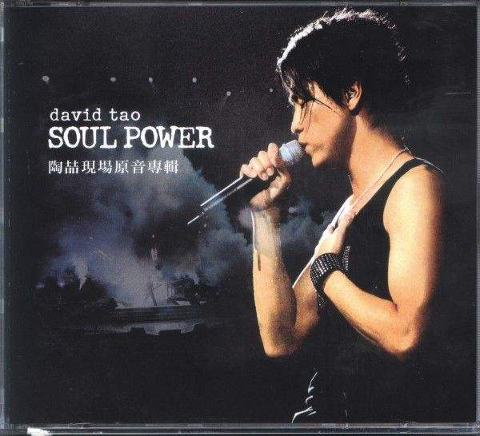

# 强大自我，是解决问题唯一方法

这个仓库是我的主要仓库，主要写一些计算机视觉基础的东西。

其中包含：

- ** 计算机基础（数据结构、mysql、flask准备学习）**
- **目标检测   (将要更新YOLOV4个人实验版)**
- **语义分割 （将要更新分层注意力机制技术文档）**
- **人脸检测与识别（centernet+arcface）**
- **模型推理 (ONNX TensorRT TNN)**
- **图像处理基础**

特别感谢：我的师弟伟业和映谦大佬YOLOV3-keras的工作！！！

最近学习计划：

